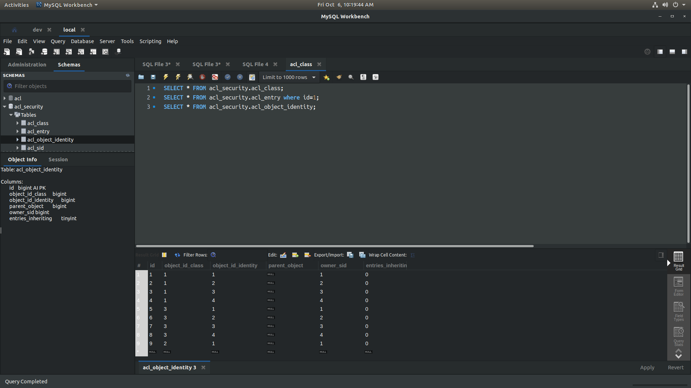
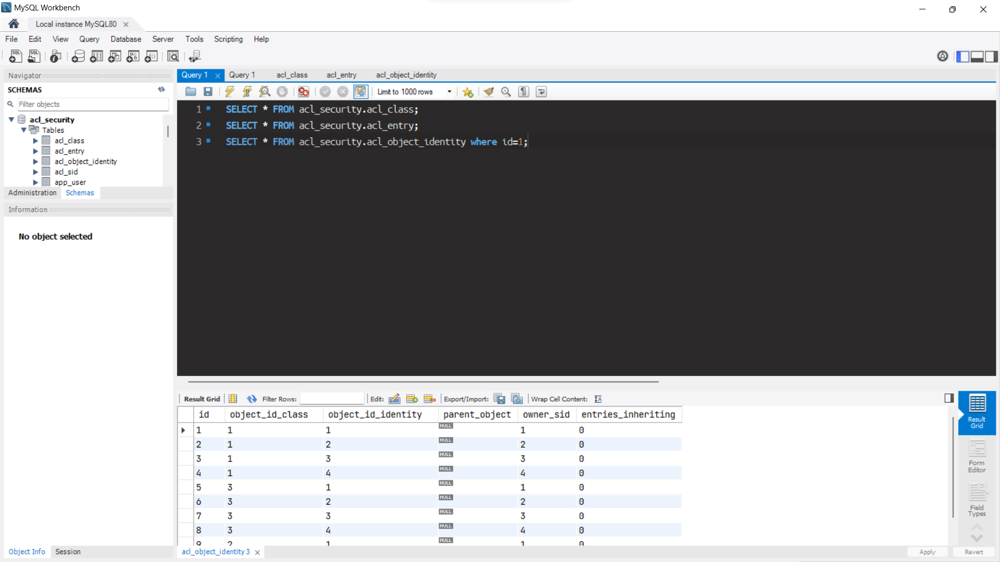

# How To use MySQL Workbench DarkTheme ?

* Backup file code_editor.xml in your operating system from the below destination
  According to the operating system

````
Ubuntu  
/usr/share/mysql-workbench/data/code_editor.xml

Windows
C:\Program Files\MySQL\MySQL Workbench X.X\data\code_editor.xml

MacOS
Contents/Resources/data/code_editor.xml
````
* Replace the content of code_editor.xml 
 or Replace the file
  from the above destination
  According to the operating
  system with the provided code_editor.xml file in this project

## Ubuntu Linux MySQL Workbench DarkTheme


## Windows MySQL Workbench DarkTheme


* [ Install Ubuntu or any LINUX OS for Development (Recommended)  ]
  (https://releases.ubuntu.com/jammy/)
  